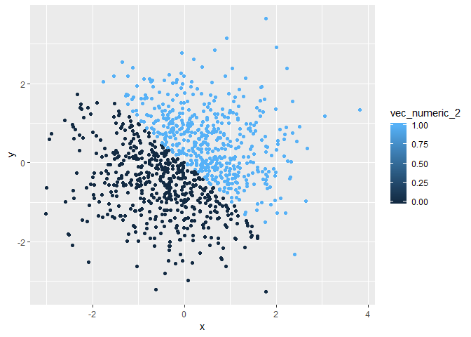

p8105\_hw1\_ml4239
================

**Problem\_1**
==============

Create a data frame named as problem\_1\_data\_frame
----------------------------------------------------

``` r
library(tidyverse)
```

    ## -- Attaching packages --------------------------------------------------------------------------------- tidyverse 1.2.1 --

    ## v ggplot2 3.0.0     v purrr   0.2.5
    ## v tibble  1.4.2     v dplyr   0.7.6
    ## v tidyr   0.8.1     v stringr 1.3.1
    ## v readr   1.1.1     v forcats 0.3.0

    ## -- Conflicts ------------------------------------------------------------------------------------ tidyverse_conflicts() --
    ## x dplyr::filter() masks stats::filter()
    ## x dplyr::lag()    masks stats::lag()

``` r
set.seed(1)
problem_1_data_frame = tibble(
  uniform_sample = runif(10, min = 0, max = 5),
  vec_logic = uniform_sample > 2,
  vec_character = c("x","y","z","z","z","y","x","z","y","x"),
  vec_factor = factor(c("I","you","she","he", "it", "they", "ze", "he", "xe", "none"))
)
```

Take the mean of each variable in dataframe 'problem\_1\_data\_frame'.
----------------------------------------------------------------------

``` r
mean(problem_1_data_frame$uniform_sample)
```

    ## [1] 2.757569

``` r
mean(problem_1_data_frame$vec_logic)
```

    ## [1] 0.6

``` r
mean(problem_1_data_frame$vec_character)
```

    ## Warning in mean.default(problem_1_data_frame$vec_character): argument is
    ## not numeric or logical: returning NA

    ## [1] NA

``` r
mean(problem_1_data_frame$vec_factor)
```

    ## Warning in mean.default(problem_1_data_frame$vec_factor): argument is not
    ## numeric or logical: returning NA

    ## [1] NA

The mean of random sample and logical vector work.
The mean of character vector and factor vector do not work. Because the variables in the last two are not numeric or logical.

Convert variables from one type to another
------------------------------------------

-   Applies the as.numeric function to the logical, character, and factor variables

``` r
as.numeric(problem_1_data_frame$vec_logic)
as.numeric(problem_1_data_frame$vec_character)
as.numeric(problem_1_data_frame$vec_factor)
```

The variables in vec\_logic convert to "0"&"1" from "Flase"&"True".
The variables in vec\_charater convert to NA.
The variables in vec\_factor convert to different numbers according to their levels (in alphabet).

-   Convert character variable from character to factor to numeric; similarly, convert factor variable from factor to character to numeric.

``` r
as.numeric(as.factor(problem_1_data_frame$vec_character))
```

    ##  [1] 1 2 3 3 3 2 1 3 2 1

``` r
as.numeric(as.character(problem_1_data_frame$vec_factor))
```

    ## Warning: NAs introduced by coercion

    ##  [1] NA NA NA NA NA NA NA NA NA NA

The variables from character variable from character to factor to numeric are convert to numbers according to the factor level.
The variables from factor variable from factor to character to numeric are convert to NA.

**Problem\_2**
==============

Create a data frame named problem\_2\_data\_frame
-------------------------------------------------

``` r
problem_2_data_frame = tibble(
  x = rnorm(1000),
  y = rnorm(1000),
  vec_logic_2 = x + y > 0,
  vec_numeric_2 = as.numeric(vec_logic_2),
  vec_factor_2 = as.factor(vec_logic_2)
)
```

The size of the dataset is 3.389610^{4}
The mean of x is -0.0106382
The median of x is -0.031318
The proportion of cases for which the logical vector is `TRUE` is 0.49

Make a scatterplot
------------------

-   scatterplot of `y` vs `x` using logical variable

``` r
library(ggplot2)
plot_1 = ggplot(problem_2_data_frame, aes(x, y))+geom_point(aes(colour = vec_logic_2))
plot_1
```


-   scatterplot of `y` vs `x` using numeric variables

``` r
library(ggplot2)
plot_2 = ggplot(problem_2_data_frame, aes(x, y))+geom_point(aes(colour = vec_numeric_2))
plot_2
```



-   scatterplot of `y` vs `x` using factor variables

``` r
library(ggplot2)
plot_3 = ggplot(problem_2_data_frame, aes(x, y))+geom_point(aes(colour = vec_factor_2))
plot_3
```

 The color scale using numeric variables is larger than using factor variables.Color scale using factor variables has two colors but using numerica variables gets the color range from 0 to 1.

-   Export your first scatterplot to your project directory

``` r
ggsave("first scatterplot.pdf")
```

    ## Saving 7 x 5 in image
